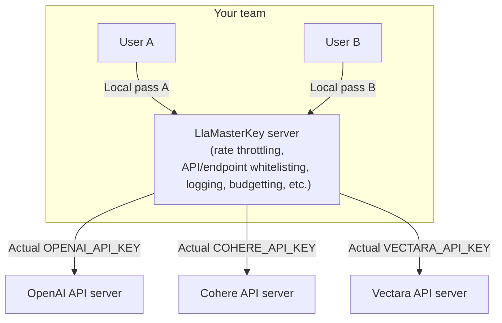

# LlaMaKey: one master key for accessing all cloud LLM/GenAI APIs

Introducing LlaMa(ster)Key, the simplified and secure way to manage API keys and control the access to various cloud LLM/GenAI APIs for multiple users. LlaMaKey enables a user to access multiple cloud AI APIs through a single, user-unique master key, instead of a bunch of API keys, one for each platform. As a proxy, it eases key management for both the user and the administrator by consolidating the keys distributed to a user to just one while enhancing the protection of the actual API keys by hiding them from the user. Major cloud AI APIs (OpenAI, Cohere, AnyScale, etc.) can be seamlessly called in their official Python SDKs without any code changes. In addition, administrators can control individual users in detail through rate throttling, API/endpoint whitelisting, budget capping, etc. LlaMaKey is open source under MIT license and is ready for private, on-premises deployment.



## The pain and the solution

How do you manage the API keys in a team needing to access an array of cloud LLM/GenAI APIs?
If you get one key per user per API, then you have too many keys to manage.
But if you share the key per API, then it is too risky. What if your careless intern accidentally pushes it to a public Github repo?

This is when LlamaKey comes to play. It is a proxy between your users and the actual cloud AI API. To authenticate, only one key is needed between your team member's code and your LlamaKey server. If any of them makes you unhappy, just revoke one key to cut him/her loss without interrupting others.

A user does not need to change a single line of code to use LlaMaKey. LlaMaKey takes advantage of a feature in the official Python SDKs of most cloud LLM/GenAI APIs that each of them has a `BASE_URL` which is configurable in the environment variables:

* `OPENAI_BASE_URL` for OpenAI
* `CO_API_URL` for Cohere
* `ANYSCALE_BASE_URL` for AnyScale

So the user only needs to set the respectively `BASE_URL` to the LlaMaKey server. Then the request is first make to a LlaMaKey server, which then forwards it to the real cloud LLM/GenAI endpoint.

## Roadmap

1. Currently, authentication with the LlaMaKey server is not enabled. If you want us to support it, please open an issue on Github. We will see it as a demand and prioritize it accordingly.
2. Supported APIs:

   * [x] OpenAI (all endpoints)
   * [x] Cohere (all endpoints)
   * [x] AnyScale
   * [x] HuggingFace Inference API (free tier)
   * [ ] HuggingFace EndPoint API
   * [ ] Anthropic
   * [ ] Google Vertex AI
   * [x] [Vectara AI](https://vectara.com/)

## Installation

Stable version:

```bash
pip install LLaMasterKey
```

Nightly version:

You can manually install the nightly version at:

<https://github.com/TexteaInc/LlaMasterKey/releases/tag/nightly>

## Build from source

Requirements:

* git
* Rust Toolchains: <https://www.rust-lang.org/tools/install>

```bash
git clone git@github.com:TexteaInc/LlaMasterKey.git
# you can switch to a different branch:
# git switch dev
cargo build --release
# available at ./target/release/lmk
```

## Usage

**On the server end**, set up the actual API keys in the environment variable per their respective APIs and start your LlaMaKey server, for example:

```bash
export OPENAI_API_KEY=sk-xxx # openai
export CO_API_KEY=co-xxx # cohere
export HF_TOKEN=hf-xxx # huggingface
export ANYSCALE_API_KEY=as-xxx # anyscale
export ANTHROPIC_API_KEY=an-xxx # anthropic
# vectara
export VECTARA_CUSTOMER_ID=xxxx
export VECTARA_CLIENT_ID=xxxx
export VECTARA_CLIENT_SECRET=xxxx

lmk # start the server
```

The server will read keys of supported LLM/GenAI APIs from the OS environment variables and start a server at `http://localhost:8000` (8000 is the default port of FastAPI). It will generate the shell command to activate certain environment variables on your client end, like this:

```bash
export OPENAI_BASE_URL="http://127.0.0.1:8000/openai" # direct OpenAI calls to the LlaMaKey server
export OPENAI_API_KEY="LlaMaKey" # a placeholder master key
```

For your convenience, the commands are also dumped to the file`./llamakey_local.env`.

**On the client end**, activate the environment variables generated above before running your code. You can copy and paste the commands above or simply source the `llamakey_local.env` file generated in the previous step, for example:

```bash
# step 1: activate the environment variables that directs the API calls to the LlaMaKey server
source llamakey_local.env # this is only one of many ways to do it.

# Step 2: Call OpenAI as usual using its offical Python SDK
python3 -c '\
from openai import OpenAI;
client = OpenAI();
print (\
  client.chat.completions.create(\
    model="gpt-3.5-turbo",\
    messages=[{"role": "user", "content": "What is FastAPI?"}]
  )
)'
```

## License

Ah, this is important. Let's say MIT for now?

## Contact

For usage, bugs, or feature requests, please open an issue on Github. For private inquiries, please email `hello@funix.io`.
