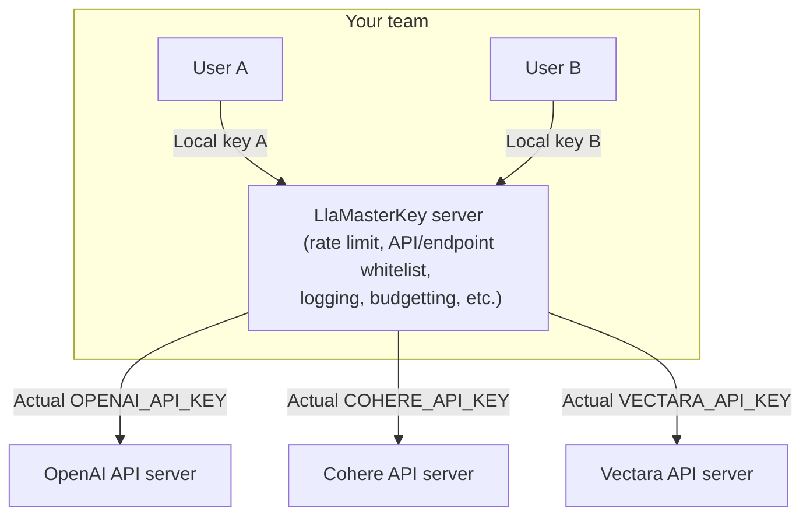

# LlamaKey: An LLM/GenAI proxy for API key protection and management 



* Easy for your team/users/customers: Just run a few commands to set the `BASE_URL` and `KEY` environment variables that the official Python SDKs of most cloud LLM/GenAI APIs (OpenAI, Cohere, HuggingFace, etc.) read in. No need to change a single line of code.
* Hide and protect the actual API keys from your team members and customers. 
* Control and track your users: set up rate limits, whitelist APIs and endpoints, control budget, and log usage.
* Open source, supporting local/on-premise deployment.

How do you manage the API keys in a team needing to access an array of cloud LLM/GenAI APIs?
If you get one key per user per API, then you have too many keys to manage.
But if you share the key per API, then it is too risky. What if your careless intern accidentally pushes it to a public Github repo?

This is when LlamaKey comes to play. It is a proxy that dispatches the requests to the real cloud LLM/GenAI endpoints and returns the responses to your team. To authenticate, only one key is needed between your team member's code and your LlamaKey server. If any of them makes you unhappy, just revoke one key to cut him/her loss without interrupting others. 

Your users do not need to change a single line of code, if they use the official Python-SDK of the API providers. They just need to set `BASE_URL` to your LlamaKey server. Then they can use the cloud LLM/GenAI APIs as usual. All endpoints are supported. 

## Roadmap

1. Currently authentication with the LlamaKey server is not enabled. If you want us to support it, please open an issue on Github.
2. Supported APIs (if we support an API, then all endpoints of it are supported):
   - [x] OpenAI
   - [x] Cohere
   - [x] AnyScale
   - [x] HuggingFace Inference API (free tier)
   - [ ] HuggingFace EndPoint API
   - [ ] Anthropic
   - [ ] Google Vertex AI
   - [x] [Vectara AI](https://vectara.com/)

## Installation

Stable version:

```bash
pip install LLaMasterKey
```

Nightly version:

```bash
pip install git+https://github.com/TexteaInc/LlaMasterKey.git
```

Development version:

```bash
git clone https://github.com/TexteaInc/LlamaKey.git -b dev
cd LlamaKey
pip install -e .
```

## Usage

**On the server end**, set up the API keys on the LlamaKey server side and start your LlamaKey server: 
```bash
export OPENAI_API_KEY=sk-xxx #openai

lmk # start the server
```

The server will read keys of supported LLM/GenAI APIs set in the OS environment variables and start a server at `http://localhost:8000` (8000 is the default port of FastAPI). It will generate the command to activate certain environment variables on your client end, like this:

```bash
export OPENAI_BASE_URL="http://127.0.0.1:8000" # direct OpenAI calls to the LlamaKey server
export OPENAI_API_KEY="openai" # a fake key. the real key needs not to be known by the client 
```

For your convinience, the commands are also dumped to the  file`./llamakey_local.env` in the current directory.

**On the client end**, activate the environment variables generated above before running your code. You can copy and paste the commands above or simply source the `llamakey_local.env` file generated in the previous step like below: 

```bash
source llamakey_local.env # one way to activate them 

# Call OpenAI as usual using its offical Python SDK
python3 -c '\
from openai import OpenAI; 
client = OpenAI(); 
print (\
  client.chat.completions.create(\
    model="gpt-3.5-turbo",\
    messages=[{"role": "user", "content": "What is FastAPI?"}]
  )
)'
```

## How does it work? 

It's as simple as setting a few environment variables. 
We take advantage of a feature in the official Python SDKs of most cloud LLM/GenAI APIs that they allow configuring a `BASE_URL` in the environment variables. So just set the `BASE_URL` to our LlamaKey server. No need to change a single line of code. Such `BASE_URL`s are: `OPENAI_BASE_URL`, `CO_API_URL`, `ANYSCALE_BASE_URL`, `HF_INFERENCE_ENDPOINT`, etc.    


### For HuggingFace

If you work through `huggingface_hub.InferenceClient()` it works fine. But if you are working through `requests` like:

```python
import requests

API_URL = "https://api-inference.huggingface.co/models/t5-small"
headers = {"Authorization": "Bearer **********"}

def query(payload):
   response = requests.post(API_URL, headers=headers, json=payload)
   return response.json()

output = query({
   "inputs": "Меня зовут Вольфганг и я живу в Берлине",
})
```

You need to change the `API_URL` to `os.environ["HF_INFERENCE_ENDPOINT"] + "/models/t5-small"`, and change the `Authorization` header to `os.environ["HF_TOKEN"]`.

For example, if you want to use the `t5-small` model, you can do:

```python
import os
import requests

API_URL = f"{os.environ['HF_INFERENCE_ENDPOINT']}/models/t5-small"
headers = {"Authorization": f"Bearer {os.environ['HF_TOKEN']}"}

def query(payload):
   response = requests.post(API_URL, headers=headers, json=payload)
   return response.json()

output = query({
   "inputs": "Меня зовут Вольфганг и я живу в Берлине",
})
```

## License

Ah, this is important. Let's say MIT for now?

## Contact

For usage, bugs, or feature requests, please open an issue on Github. For private inquiries, please email `hello@funix.io`. 