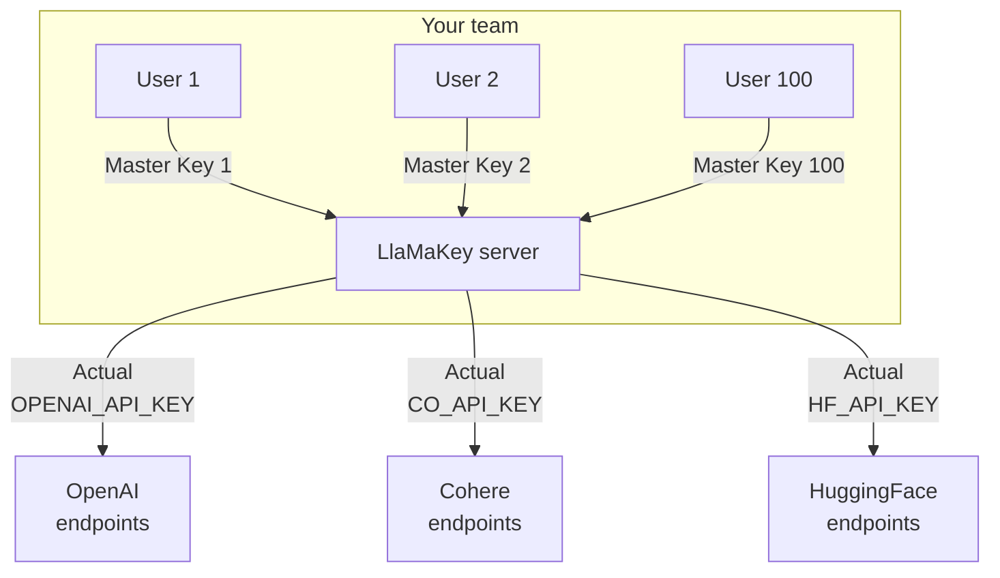
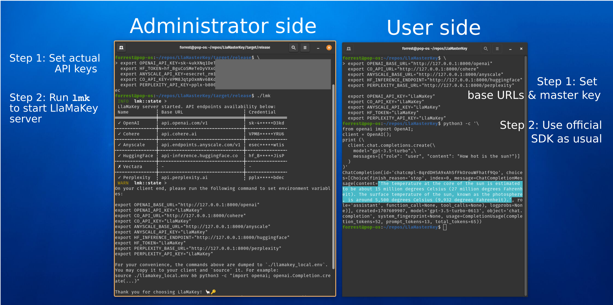

# LlaMaKey: one master key for accessing all cloud LLM/GenAI APIs

LlaMaKey is the easy and secure solution for key management of multiple users and multiple cloud LLM/GenAI APIs. 
LlaMaKey gives each user **one master key** to access multiple cloud AI APIs (OpenAI, Cohere, AnyScale, HuggingFace, Perplexity) through their official SDKs with **no code change** nor knowing the actual API keys. ([How it works](#how-llamakey-works))

* For each user, one master key for multiple APIs.
* The master key is unique to each user. Granting and revoking a user's access won't impact other users. 
* The actual API keys to authenticate with cloud APIs are never known to users. 
* No code change! Keep using the official Python SDK of the cloud AI APIs.

It solves the pain point of having too many keys to manage for both the user and the administrator and eliminates the risk of key leakage due to user carelessness.



## Roadmap

Supported APIs:

* [x] OpenAI (all endpoints)
* [x] Cohere (all endpoints)
* [x] AnyScale (AnyScale API is OpenAI-client compatible)
* [x] Perplexity AI (Perplexity API is OpenAI-client compatible)
* [x] HuggingFace Inference API (free tier)
* [ ] HuggingFace EndPoint API
* [ ] Anthropic
* [ ] Google Vertex AI
* [x] [Vectara AI](https://vectara.com/)

Currently, authentication with the LlaMaKey server is not enabled. All users share the master key `LlaMaKey`. If you want to see it, please [upvote here](https://github.com/TexteaInc/LlaMasterKey/issues/6).

## Installation

* Stable version:

  ```bash
  pip install llamakey
  ```

* Nightly version: download from [here](https://github.com/TexteaInc/LlaMasterKey/releases/tag/nightly)
* For building from source, see [Build from source](#build-from-source).

## Usage



### The server end

Set up the actual API keys as environment variables per their respective APIs, and then start the server, for example:

```bash
# Step 1: Set the actual API keys as environment variables
export OPENAI_API_KEY=sk-xxx # openai
export CO_API_KEY=co-xxx # cohere
export HF_TOKEN=hf-xxx # huggingface
export ANYSCALE_API_KEY=credential-xxx # anyscale
export PERPLEXITY_API_KEY=pplx-xxx # perplexity

lmk # Step 2: start the server
```

By default, the server is started at `http://localhost:8000` (8000 is the default port of FastAPI).

Shell commands to activate proper environment variables on your client end will be printed, like this:

```bash
export OPENAI_BASE_URL="http://127.0.0.1:8000/openai" # direct OpenAI calls to the LlaMaKey server
export CO_API_URL="http://127.0.0.1:8000/cohere"
export ANYSCALE_BASE_URL="http://127.0.0.1:8000/anyscale"
export HF_INFERENCE_ENDPOINT="http://127.0.0.1:8000/huggingface"

export OPENAI_API_KEY="LlaMaKey" # One master key for all APIs
export CO_API_KEY="LlaMaKey"
export ANYSCALE_API_KEY="LlaMaKey"
export HF_TOKEN="LlaMaKey"
```

Such environment variables will direct the API calls to the LlaMaKey server. For your convenience, the commands are also dumped to the file`./llamakey_client.env`.

### The client end

Just activate the environment variables generated above and then run your code as usual!
You may copy and paste the commands above or simply source the `llamakey_client.env` file generated above, for example:

```bash
# step 1: activate the environment variables that tell official SDKs to make requests to LlaMaKey server
source llamakey_client.env

# Step 2: Call offical Python SDKs as usual, for example, for OpenAI:
python3 -c '\
from openai import OpenAI;
client = OpenAI();
print (\
  client.chat.completions.create(\
    model="gpt-3.5-turbo",\
    messages=[{"role": "user", "content": "How hot is the sun?"}]
  )
)'
```

## Build from source

Requirements: git and  [Rust Toolchain](https://www.rust-lang.org/tools/install).

```bash
git clone git@github.com:TexteaInc/LlaMasterKey.git
# you can switch to a different branch:
# git switch dev
cargo build --release
# binary at ./target/release/lmk

# run it without installation
cargo run
# you can also install it system-wide
cargo install --path .

# run it
lmk
```

## How LlaMaKey works

As a proxy, LlaMaKey takes advantage of a feature in the Python SDK of most cloud LLM/GenAI APIs that they allow setting the base URL and API keys/tokens to and with which a request is sent and authenticated ([OpenAI's](https://github.com/openai/openai-python/blob/d231d1fa783967c1d3a1db3ba1b52647fff148ac/src/openai/_client.py#L95-L108), [Cohere's](https://github.com/cohere-ai/cohere-python/blob/6e035811ecbf33744a5618946371e0e548eb2e73/cohere/client.py#L86-L87)). The base URL and API key can be set easily via environment variables. So a client just needs to set such environment variables (or manually configure in their code) and then call the APIs as usual -- see [how simple and easy](#the-client-end). LlaMaKey will receive the request, authenticate the user (if authentication is enabled), and then forward the request to the corresponding actual cloud API with an actual API key (set by the administrator when starting a LlaMaKey server). The response will be passed back to the client after the LlaMaKey server hears back from a cloud API.

## License

Ah, this is important. Let's say MIT for now?

## Contact

For usage, bugs, or feature requests, please open an issue on Github. For private inquiries, please email `hello@LlaMaKey.ai`.
