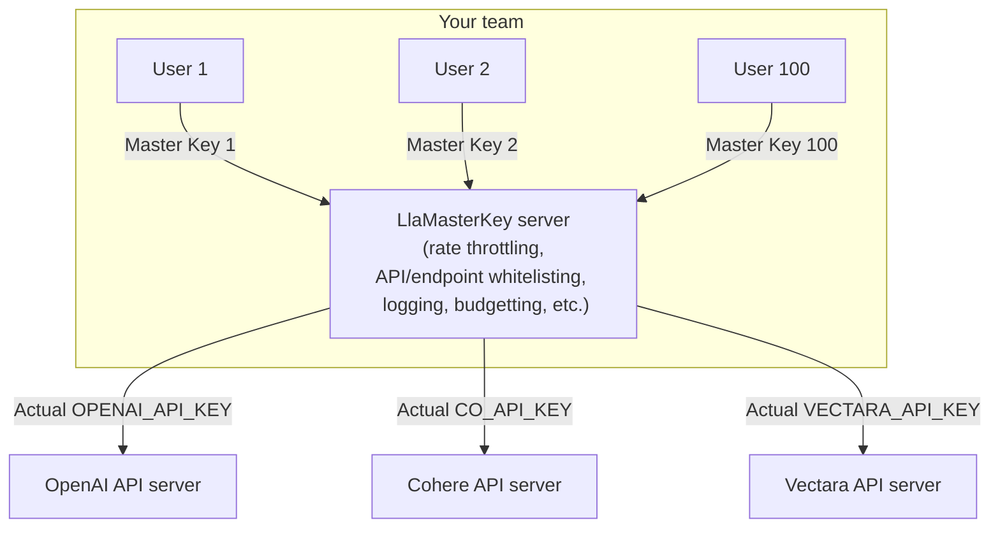

# LlaMaKey: one master key for accessing all cloud LLM/GenAI APIs

Introducing LlaMa(ster)Key, the simplified and secure way to manage API keys and control the access to various cloud LLM/GenAI APIs for multiple users. LlaMaKey enables a user to access multiple cloud AI APIs through a one master key unique to the user, instead of a bunch of API keys, one for each platform. As a proxy, it eases key management for both the user and the administrator by consolidating the keys distributed to a user to just one while enhancing the protection of the actual API keys by hiding them from the user. Major cloud AI APIs (OpenAI, Cohere, AnyScale, etc.) can be seamlessly called in their official Python SDKs without any code changes. In addition, administrators can control individual users in detail through rate throttling, API/endpoint whitelisting, budget capping, etc. LlaMaKey is open source under MIT license and is ready for private, on-premises deployment.



* **The pain point:** How do you manage the API keys in a team needing to access an array of cloud LLM/GenAI APIs?
If you get one key per user per API, then you have a quadratic number of, or MxN, keys to manage where M is the number of APIs and N is the number of users.
But if you share a key among users, then it is prone to risk and hassles. What if your careless intern accidentally pushes it to a public Github repo? Revoking the key will interrupt the work of all other users.
* **The solution** This is when LlamaKey comes to play. It is a proxy between your users and the actual cloud AI API. A user gets one master key unique to him/her to authenticate with your LlamaKey server which will connect him/her to many cloud AI APIs. Cutting one user loose will not interrupt others. You can even control which APIs each user or user group are allowed to access, their rate limits, budget caps, etc.

Supported APIs:
* [x] OpenAI (all endpoints)
* [x] Cohere (all endpoints)
* [x] AnyScale
* [x] HuggingFace Inference API (free tier)
* [ ] HuggingFace EndPoint API
* [ ] Anthropic
* [ ] Perplexity 
* [ ] Google Vertex AI
* [x] [Vectara AI](https://vectara.com/)

Currently, authentication with the LlaMaKey server is not enabled. All users share the master key `LlaMaKey`. If you want to see it, please [upvote here](https://github.com/TexteaInc/LlaMasterKey/issues/6). 

## How LlaMaKey works 

As a proxy, LlaMaKey takes advantage of a feature in the Python SDK of most cloud LLM/GenAI APIs that they allow setting the base URL and API keys/tokens to and with which a request is sent and authenticated ([OpenAI's](https://github.com/openai/openai-python/blob/d231d1fa783967c1d3a1db3ba1b52647fff148ac/src/openai/_client.py#L95-L108), [Cohere's](https://github.com/cohere-ai/cohere-python/blob/6e035811ecbf33744a5618946371e0e548eb2e73/cohere/client.py#L86-L87)). The base URL and API key can be set easily via environment variables. So a client just needs to set such environment variables (or manually configure in their code) and then call the APIs as usual -- see [how simple and easy](#the-client-end). LlaMaKey will receive the request, authenticate the user (if authentication is enabled), and then forward the request to the corresponding actual cloud API with an actual API key (set by the administrator when starting a LlaMaKey server). The response will be passed back to the client after the LlaMaKey server hears back from a cloud API.

## Installation

* Stable version:

  ```bash
  pip install LLaMasterKey
  ```

* Nightly version (manually install):

  <https://github.com/TexteaInc/LlaMasterKey/releases/tag/nightly>

### Build from source

Requirements: git and  [Rust Toolchain](https://www.rust-lang.org/tools/install). 

```bash
git clone git@github.com:TexteaInc/LlaMasterKey.git 
# you can switch to a different branch:
# git switch dev
cargo build --release
# binary at ./target/release/lmk

# run it without installation
cargo run
# you can also install it system-wide
cargo install --path .

# run it
lmk
```

## Usage

### The server end 
Set up the actual API keys as environment variables per their respective APIs, and then start the server, for example:

```bash
# Set the actual API keys as environment variables 
export OPENAI_API_KEY=sk-xxx # openai
export CO_API_KEY=co-xxx # cohere
export HF_TOKEN=hf-xxx # huggingface
export ANYSCALE_API_KEY=credential-xxx # anyscale

lmk # start the server
```

By default, the server is started at `http://localhost:8000` (8000 is the default port of FastAPI). 

It will generate the shell commands to activate certain environment variables on your client end, like this:
```bash
export OPENAI_BASE_URL="http://127.0.0.1:8000/openai" # direct OpenAI calls to the LlaMaKey server
export CO_API_URL="http://127.0.0.1:8000/cohere"
export ANYSCALE_BASE_URL="http://127.0.0.1:8000/anyscale"
export HF_INFERENCE_ENDPOINT="http://127.0.0.1:8000/huggingface"

export OPENAI_API_KEY="LlaMaKey" # One master key for all APIs
export CO_API_KEY="LlaMaKey"
export ANYSCALE_API_KEY="LlaMaKey"
export HF_TOKEN="LlaMaKey"
```
Such environment variables will direct the API calls to the LlaMaKey server. For your convenience, the commands are also dumped to the file`./llamakey_local.env`.

###  The client end 
Just activate the environment variables generated above and then run your code as usual! 
You may copy and paste the commands above or simply source the `llamakey_local.env` file generated above, for example:

```bash
# step 1: activate the environment variables that tell official SDKs to make requests to LlaMaKey server
source llamakey_local.env 

# Step 2: Call offical Python SDKs as usual, for example, for OpenAI: 
python3 -c '\
from openai import OpenAI;
client = OpenAI();
print (\
  client.chat.completions.create(\
    model="gpt-3.5-turbo",\
    messages=[{"role": "user", "content": "What is FastAPI?"}]
  )
)'
```

## License

Ah, this is important. Let's say MIT for now?

## Contact

For usage, bugs, or feature requests, please open an issue on Github. For private inquiries, please email `bao@textea.co`.